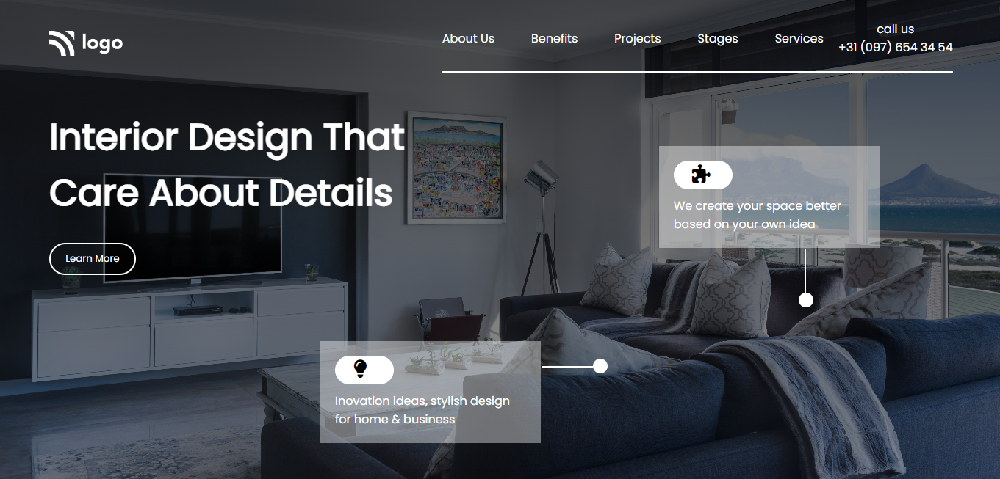

# Assignment - 10

## Project 10 [Live Link](https://full-stack-js-projects-10.netlify.app/)

- ### skills used in project
  - Learn css position media query, flexbox etc.
  - Learn to making background images responsive.
  - Total time taken 5hr to complete.
## Screenshot
### Desktop

